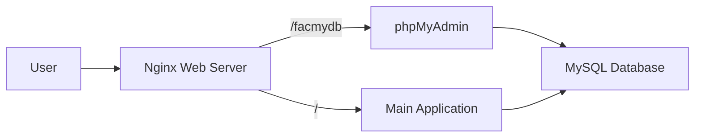

# 🗄️ phpMyAdmin Setup Guide - Fayeed Auto Care

> **Complete guide to install and configure phpMyAdmin with custom access path `/facmydb`**

This guide provides comprehensive instructions for setting up phpMyAdmin for the Fayeed Auto Care database with a custom access path at `yoursite.com/facmydb` for enhanced security and professional presentation.

[](https://www.phpmyadmin.net/)
[](https://mysql.com/)
[](https://nginx.org/)
[](https://github.com/fayeedautocare)

---

## 📋 Table of Contents

- [🎯 Overview](#-overview)
- [📋 Requirements](#-requirements)
- [⚡ Quick Setup](#-quick-setup)
- [🔧 Manual Installation](#-manual-installation)
- [🐳 Docker Setup](#-docker-setup)
- [🔒 Security Configuration](#-security-configuration)
- [🌐 Custom Domain Setup](#-custom-domain-setup)
- [✅ Testing & Verification](#-testing--verification)
- [🛠️ Maintenance](#️-maintenance)
- [🔧 Troubleshooting](#-troubleshooting)

---

## 🎯 Overview

### 🎨 **Custom Access Configuration**

Instead of the standard phpMyAdmin access at `/phpmyadmin`, this setup provides:

- **Custom Path**: `yoursite.com/facmydb`
- **Professional URL**: Branded for Fayeed Auto Care
- **Enhanced Security**: Custom path obscures phpMyAdmin presence
- **Integrated Design**: Seamless integration with main application

### 🏗️ **Architecture**



### 🔗 **Access URLs**

| Service | URL | Purpose |
|---------|-----|---------|
| **Main App** | `https://yoursite.com/` | Customer interface |
| **Admin Panel** | `https://yoursite.com/admin` | Admin dashboard |
| **Database Admin** | `https://yoursite.com/facmydb` | phpMyAdmin interface |
| **API Docs** | `https://yoursite.com/api/docs` | API documentation |

---

## 📋 Requirements

### 💻 **System Requirements**

| Component | Minimum | Recommended | Notes |
|-----------|---------|-------------|-------|
| **OS** | Ubuntu 18.04, CentOS 7 | Ubuntu 22.04, Rocky Linux 9 | Linux distributions |
| **RAM** | 2GB | 4GB+ | For optimal performance |
| **Storage** | 10GB free | 50GB+ | Including database space |
| **CPU** | 2 cores | 4+ cores | Multi-threading support |

### 🔧 **Software Requirements**

| Software | Version | Purpose | Installation |
|----------|---------|---------|--------------|
| **MySQL** | 8.0+ | Database server | `apt install mysql-server` |
| **Nginx** | 1.20+ | Web server | `apt install nginx` |
| **PHP** | 8.1+ | Server-side processing | `apt install php8.2-fpm` |
| **phpMyAdmin** | 5.2+ | Database admin interface | Manual installation |

### 📦 **PHP Extensions Required**

```bash
# Ubuntu/Debian
sudo apt install php8.2-fpm php8.2-mysql php8.2-mbstring php8.2-zip \
                 php8.2-gd php8.2-json php8.2-curl php8.2-xml \
                 php8.2-intl php8.2-bcmath php8.2-bz2

# CentOS/RHEL
sudo yum install php-fpm php-mysql php-mbstring php-zip \
                php-gd php-json php-curl php-xml \
                php-intl php-bcmath php-bz2
```

---

## ⚡ Quick Setup

### 🚀 **One-Command Installation**

```bash
# Download and run the setup script
curl -fsSL https://raw.githubusercontent.com/fayeedautocare/setup/main/scripts/setup-phpmyadmin.sh | sudo bash
```

### 🐳 **Docker Quick Start**

```bash
# Clone repository and start services
git clone https://github.com/fayeedautocare/system.git
cd fayeed-auto-care

# Start with phpMyAdmin
docker-compose -f docker-compose.phpmyadmin.yml up -d

# Access phpMyAdmin
open http://localhost/facmydb
```

### ✅ **Quick Verification**

```bash
# Check if phpMyAdmin is accessible
curl -I http://localhost/facmydb

# Should return: HTTP/1.1 200 OK
```

---

## 🔧 Manual Installation

### 📥 **Step 1: Download phpMyAdmin**

```bash
# Create directory
sudo mkdir -p /var/www/phpmyadmin

# Download latest version
cd /tmp
wget https://files.phpmyadmin.net/phpMyAdmin/5.2.1/phpMyAdmin-5.2.1-all-languages.zip

# Extract and install
unzip phpMyAdmin-5.2.1-all-languages.zip
sudo cp -r phpMyAdmin-5.2.1-all-languages/* /var/www/phpmyadmin/

# Set permissions
sudo chown -R www-data:www-data /var/www/phpmyadmin
sudo chmod -R 755 /var/www/phpmyadmin
```

### ⚙️ **Step 2: Configure phpMyAdmin**

```bash
# Create configuration file
sudo nano /var/www/phpmyadmin/config.inc.php
```

```php
<?php
// Basic phpMyAdmin configuration for Fayeed Auto Care
$cfg['blowfish_secret'] = 'fayeed-auto-care-32-char-secret-key!';

$i = 0;
$i++;
$cfg['Servers'][$i]['host'] = 'localhost';
$cfg['Servers'][$i]['port'] = '3306';
$cfg['Servers'][$i]['auth_type'] = 'cookie';
$cfg['Servers'][$i]['only_db'] = 'fayeed_auto_care';

// Security settings
$cfg['AllowArbitraryServer'] = false;
$cfg['LoginCookieValidity'] = 3600;
$cfg['CheckConfigurationPermissions'] = false;

// UI customization
$cfg['TitleServer'] = 'Fayeed Auto Care - Database Administration';
$cfg['AllowUserDropDatabase'] = false;

// Hide system databases
$cfg['Servers'][$i]['hide_db'] = '^(information_schema|performance_schema|mysql|sys)$';

// File upload settings
$cfg['UploadDir'] = '/tmp/';
$cfg['SaveDir'] = '/tmp/';
?>
```

### 🌐 **Step 3: Configure Nginx**

```bash
# Create Nginx configuration
sudo nano /etc/nginx/sites-available/phpmyadmin
```

```nginx
server {
    listen 80;
    server_name your-domain.com;  # Replace with your domain
    
    # Main application root
    root /var/www/html;
    index index.php index.html index.htm;
    
    # phpMyAdmin configuration for custom path /facmydb
    location /facmydb {
        alias /var/www/phpmyadmin;
        index index.php index.html index.htm;
        
        # Security headers
        add_header X-Frame-Options "SAMEORIGIN" always;
        add_header X-Content-Type-Options "nosniff" always;
        add_header X-XSS-Protection "1; mode=block" always;
        add_header Referrer-Policy "strict-origin-when-cross-origin" always;
        
        # Handle PHP files
        location ~ /facmydb/(.+\.php)$ {
            alias /var/www/phpmyadmin;
            
            # Security - deny access to sensitive directories
            location ~ /facmydb/(libraries|setup|config)/ {
                deny all;
                return 404;
            }
            
            fastcgi_split_path_info ^(.+\.php)(/.+)$;
            fastcgi_pass unix:/var/run/php/php8.2-fpm.sock;
            fastcgi_index index.php;
            
            include fastcgi_params;
            fastcgi_param SCRIPT_FILENAME /var/www/phpmyadmin/$1;
            fastcgi_param SCRIPT_NAME /facmydb/$1;
            fastcgi_param REQUEST_URI $request_uri;
            fastcgi_param DOCUMENT_ROOT /var/www/phpmyadmin;
            
            # PHP optimization
            fastcgi_param PHP_VALUE "upload_max_filesize=100M \n post_max_size=100M \n max_execution_time=300";
            
            # Timeout settings
            fastcgi_connect_timeout 300;
            fastcgi_send_timeout 300;
            fastcgi_read_timeout 300;
        }
        
        # Handle static files (CSS, JS, images)
        location ~ /facmydb/(.+\.(css|js|png|jpg|jpeg|gif|ico|svg))$ {
            alias /var/www/phpmyadmin/$1;
            expires 30d;
            add_header Cache-Control "public, immutable";
            access_log off;
        }
        
        # Deny access to sensitive files
        location ~ /facmydb/(config\.inc\.php|\.ht|\.user\.ini|\.git) {
            deny all;
            return 404;
        }
        
        # Handle directory index
        location = /facmydb/ {
            alias /var/www/phpmyadmin/;
            index index.php;
        }
    }
    
    # Your main application configuration
    location / {
        try_files $uri $uri/ /index.php?$query_string;
    }
    
    # Handle PHP for main application
    location ~ \.php$ {
        fastcgi_pass unix:/var/run/php/php8.2-fpm.sock;
        fastcgi_index index.php;
        include fastcgi_params;
        fastcgi_param SCRIPT_FILENAME $document_root$fastcgi_script_name;
    }
}
```

### 🔄 **Step 4: Enable Configuration**

```bash
# Enable the site
sudo ln -sf /etc/nginx/sites-available/phpmyadmin /etc/nginx/sites-enabled/

# Remove default site (optional)
sudo rm -f /etc/nginx/sites-enabled/default

# Test Nginx configuration
sudo nginx -t

# Reload Nginx
sudo systemctl reload nginx
```

### 🐘 **Step 5: Configure PHP-FPM**

```bash
# Edit PHP-FPM configuration
sudo nano /etc/php/8.2/fpm/php.ini

# Update these settings:
upload_max_filesize = 100M
post_max_size = 100M
max_execution_time = 300
max_input_time = 300
memory_limit = 512M

# Restart PHP-FPM
sudo systemctl restart php8.2-fpm
```

### 🗄️ **Step 6: Database Setup**

```bash
# Connect to MySQL
mysql -u root -p

# Create/verify database and user
CREATE DATABASE IF NOT EXISTS fayeed_auto_care CHARACTER SET utf8mb4 COLLATE utf8mb4_unicode_ci;
CREATE USER IF NOT EXISTS 'fayeed_user'@'localhost' IDENTIFIED BY 'fayeed_pass_2024';
GRANT ALL PRIVILEGES ON fayeed_auto_care.* TO 'fayeed_user'@'localhost';
FLUSH PRIVILEGES;
EXIT;
```

---

## 🐳 Docker Setup

### 📄 **Docker Compose Configuration**

Create `docker-compose.phpmyadmin.yml`:

```yaml
version: '3.8'

services:
  mysql:
    image: mysql:8.0
    container_name: fayeed_mysql
    environment:
      MYSQL_ROOT_PASSWORD: fayeed_root_2024
      MYSQL_DATABASE: fayeed_auto_care
      MYSQL_USER: fayeed_user
      MYSQL_PASSWORD: fayeed_pass_2024
    ports:
      - "3306:3306"
    volumes:
      - mysql_data:/var/lib/mysql
      - ./database/exports:/docker-entrypoint-initdb.d

  phpmyadmin:
    image: phpmyadmin/phpmyadmin:latest
    container_name: fayeed_phpmyadmin
    environment:
      PMA_HOST: mysql
      PMA_USER: fayeed_user
      PMA_PASSWORD: fayeed_pass_2024
      PMA_ABSOLUTE_URI: http://localhost/facmydb/
      UPLOAD_LIMIT: 100M
    volumes:
      - ./config/phpmyadmin/config.inc.php:/etc/phpmyadmin/config.user.inc.php
    depends_on:
      - mysql

  nginx:
    image: nginx:alpine
    container_name: fayeed_nginx
    ports:
      - "80:80"
      - "443:443"
    volumes:
      - ./config/nginx/phpmyadmin.conf:/etc/nginx/conf.d/default.conf
    depends_on:
      - phpmyadmin

volumes:
  mysql_data:
```

### 🚀 **Start Services**

```bash
# Start all services
docker-compose -f docker-compose.phpmyadmin.yml up -d

# Check service status
docker-compose ps

# View logs
docker-compose logs -f phpmyadmin
```

---

## 🔒 Security Configuration

### 🛡️ **Enhanced Security Measures**

#### **1. IP Address Restrictions**

```nginx
# Add to Nginx configuration inside location /facmydb block
allow 192.168.1.0/24;  # Local network
allow 10.0.0.0/8;      # Private network
deny all;
```

#### **2. Basic Authentication**

```bash
# Create password file
sudo apt install apache2-utils
sudo htpasswd -c /etc/nginx/.htpasswd admin

# Add to Nginx configuration
auth_basic "Fayeed Auto Care Database Administration";
auth_basic_user_file /etc/nginx/.htpasswd;
```

#### **3. SSL/HTTPS Configuration**

```bash
# Install Certbot
sudo apt install certbot python3-certbot-nginx

# Generate SSL certificate
sudo certbot --nginx -d yourdomain.com

# Auto-renewal
sudo crontab -e
# Add: 0 12 * * * /usr/bin/certbot renew --quiet
```

#### **4. Fail2Ban Protection**

```bash
# Install Fail2Ban
sudo apt install fail2ban

# Create phpMyAdmin jail
sudo nano /etc/fail2ban/jail.local
```

```ini
[phpmyadmin]
enabled = true
port = http,https
filter = phpmyadmin
logpath = /var/log/nginx/access.log
maxretry = 3
bantime = 3600
findtime = 600
```

### 🔐 **Security Checklist**

- [ ] ✅ Custom access path configured (`/facmydb`)
- [ ] ✅ Setup directory removed from phpMyAdmin
- [ ] ✅ Database access restricted to `fayeed_auto_care` only
- [ ] ✅ Security headers configured in Nginx
- [ ] ✅ File upload limits set appropriately
- [ ] ✅ PHP display_errors disabled in production
- [ ] ✅ SSL/HTTPS enabled
- [ ] ✅ Strong MySQL passwords set
- [ ] ✅ Regular security updates scheduled

---

## 🌐 Custom Domain Setup

### 🔧 **Domain Configuration**

#### **1. DNS Setup**

```bash
# Add A record for your domain
# Type: A
# Name: @ (or www)
# Value: YOUR_SERVER_IP
# TTL: 300
```

#### **2. Nginx Virtual Host**

```nginx
server {
    listen 80;
    server_name yourdomain.com www.yourdomain.com;
    
    # Redirect HTTP to HTTPS
    return 301 https://$server_name$request_uri;
}

server {
    listen 443 ssl http2;
    server_name yourdomain.com www.yourdomain.com;
    
    # SSL Configuration
    ssl_certificate /etc/letsencrypt/live/yourdomain.com/fullchain.pem;
    ssl_certificate_key /etc/letsencrypt/live/yourdomain.com/privkey.pem;
    ssl_protocols TLSv1.2 TLSv1.3;
    ssl_ciphers ECDHE-RSA-AES256-GCM-SHA512:DHE-RSA-AES256-GCM-SHA512;
    
    # Your phpMyAdmin and application configuration here
    # ... (previous configuration)
}
```

#### **3. Update phpMyAdmin Configuration**

```php
// Update config.inc.php
$cfg['PmaAbsoluteUri'] = 'https://yourdomain.com/facmydb/';
```

---

## ✅ Testing & Verification

### 🔍 **Functionality Tests**

#### **1. Basic Access Test**

```bash
# Test HTTP access
curl -I http://yourdomain.com/facmydb

# Expected response: HTTP/1.1 200 OK or 301/302 redirect
```

#### **2. Database Connection Test**

```bash
# Test MySQL connection
mysql -h localhost -u fayeed_user -pfayeed_pass_2024 fayeed_auto_care -e "SELECT 'Connection successful' as status;"
```

#### **3. PHP Processing Test**

```bash
# Create test PHP file
echo "<?php phpinfo(); ?>" | sudo tee /var/www/phpmyadmin/test.php

# Access via browser: https://yourdomain.com/facmydb/test.php
# Remove after testing: sudo rm /var/www/phpmyadmin/test.php
```

#### **4. Upload Functionality Test**

1. Access phpMyAdmin at `https://yourdomain.com/facmydb`
2. Login with database credentials
3. Navigate to Import tab
4. Try uploading a small SQL file
5. Verify upload works without errors

### 📊 **Performance Tests**

```bash
# Check response time
time curl -s http://yourdomain.com/facmydb > /dev/null

# Monitor server resources
htop

# Check PHP-FPM status
sudo systemctl status php8.2-fpm

# Check Nginx status
sudo systemctl status nginx
```

### 🔒 **Security Tests**

```bash
# Test unauthorized access
curl -I http://yourdomain.com/facmydb/setup/
# Should return: 404 Not Found

# Test sensitive file access
curl -I http://yourdomain.com/facmydb/config.inc.php
# Should return: 404 Not Found

# Test SQL injection protection
curl "http://yourdomain.com/facmydb/?db='; DROP TABLE users; --"
# Should be handled safely
```

---

## ��️ Maintenance

### 🔄 **Regular Maintenance Tasks**

#### **Daily Tasks**
```bash
# Check service status
sudo systemctl status nginx php8.2-fpm mysql

# Monitor disk space
df -h

# Check error logs
sudo tail -f /var/log/nginx/error.log
```

#### **Weekly Tasks**
```bash
# Update system packages
sudo apt update && sudo apt upgrade

# Backup database
mysqldump -u fayeed_user -pfayeed_pass_2024 fayeed_auto_care > backup_$(date +%Y%m%d).sql

# Rotate logs
sudo logrotate -f /etc/logrotate.conf
```

#### **Monthly Tasks**
```bash
# Update phpMyAdmin
# Download latest version and follow installation steps

# Review security logs
sudo grep "facmydb" /var/log/nginx/access.log | grep -E "(404|403|500)"

# SSL certificate renewal check
sudo certbot certificates
```

### 📋 **Backup Strategy**

#### **Database Backup Script**
```bash
#!/bin/bash
# /usr/local/bin/backup-database.sh

BACKUP_DIR="/var/backups/mysql"
DATE=$(date +%Y%m%d_%H%M%S)
DB_NAME="fayeed_auto_care"
DB_USER="fayeed_user"
DB_PASS="fayeed_pass_2024"

# Create backup directory
mkdir -p "$BACKUP_DIR"

# Create backup
mysqldump -u "$DB_USER" -p"$DB_PASS" "$DB_NAME" | gzip > "$BACKUP_DIR/fayeed_auto_care_$DATE.sql.gz"

# Remove backups older than 30 days
find "$BACKUP_DIR" -name "*.sql.gz" -mtime +30 -delete

echo "Backup completed: fayeed_auto_care_$DATE.sql.gz"
```

#### **Automated Backup Schedule**
```bash
# Add to crontab
sudo crontab -e

# Add line for daily backup at 2 AM
0 2 * * * /usr/local/bin/backup-database.sh
```

### 🔄 **Update Procedures**

#### **phpMyAdmin Updates**
```bash
# 1. Backup current installation
sudo cp -r /var/www/phpmyadmin /var/www/phpmyadmin.backup

# 2. Download new version
cd /tmp
wget https://files.phpmyadmin.net/phpMyAdmin/[VERSION]/phpMyAdmin-[VERSION]-all-languages.zip

# 3. Extract and install
unzip phpMyAdmin-[VERSION]-all-languages.zip
sudo cp -r phpMyAdmin-[VERSION]-all-languages/* /var/www/phpmyadmin/

# 4. Restore configuration
sudo cp /var/www/phpmyadmin.backup/config.inc.php /var/www/phpmyadmin/

# 5. Set permissions
sudo chown -R www-data:www-data /var/www/phpmyadmin
sudo chmod -R 755 /var/www/phpmyadmin

# 6. Test and cleanup
# Test access, then: sudo rm -rf /var/www/phpmyadmin.backup
```

---

## 🔧 Troubleshooting

### ❗ **Common Issues**

#### **Issue 1: 404 Not Found**

**Symptoms:**
- Accessing `/facmydb` returns 404 error
- Nginx error logs show "file not found"

**Solutions:**
```bash
# Check file permissions
ls -la /var/www/phpmyadmin/

# Fix permissions if needed
sudo chown -R www-data:www-data /var/www/phpmyadmin
sudo chmod -R 755 /var/www/phpmyadmin

# Check Nginx configuration
sudo nginx -t

# Check if site is enabled
ls -la /etc/nginx/sites-enabled/
```

#### **Issue 2: PHP Files Not Processing**

**Symptoms:**
- PHP files download instead of executing
- Blank pages or raw PHP code displayed

**Solutions:**
```bash
# Check PHP-FPM status
sudo systemctl status php8.2-fpm

# Start if not running
sudo systemctl start php8.2-fpm

# Check PHP-FPM socket
ls -la /var/run/php/php8.2-fpm.sock

# Test PHP configuration
sudo nginx -t
sudo php-fpm8.2 -t
```

#### **Issue 3: Database Connection Failed**

**Symptoms:**
- phpMyAdmin shows "Cannot connect to MySQL server"
- Login errors in phpMyAdmin

**Solutions:**
```bash
# Test MySQL connection
mysql -u fayeed_user -pfayeed_pass_2024 -h localhost fayeed_auto_care

# Check MySQL status
sudo systemctl status mysql

# Verify user privileges
mysql -u root -p
SHOW GRANTS FOR 'fayeed_user'@'localhost';

# Reset user if needed
DROP USER 'fayeed_user'@'localhost';
CREATE USER 'fayeed_user'@'localhost' IDENTIFIED BY 'fayeed_pass_2024';
GRANT ALL PRIVILEGES ON fayeed_auto_care.* TO 'fayeed_user'@'localhost';
FLUSH PRIVILEGES;
```

#### **Issue 4: Upload Limits**

**Symptoms:**
- Large file uploads fail
- "File too large" errors

**Solutions:**
```bash
# Check current limits
php -i | grep -E "(upload_max_filesize|post_max_size|max_execution_time)"

# Update PHP configuration
sudo nano /etc/php/8.2/fpm/php.ini

# Update these values:
upload_max_filesize = 100M
post_max_size = 100M
max_execution_time = 300

# Update Nginx configuration
sudo nano /etc/nginx/nginx.conf

# Add in http block:
client_max_body_size 100M;

# Restart services
sudo systemctl restart php8.2-fpm nginx
```

### 🔍 **Diagnostic Commands**

```bash
# Check service status
sudo systemctl status nginx php8.2-fpm mysql

# View error logs
sudo tail -f /var/log/nginx/error.log
sudo tail -f /var/log/php8.2-fpm.log

# Test configurations
sudo nginx -t
sudo php-fpm8.2 -t

# Check listening ports
sudo netstat -tlnp | grep -E "(80|443|3306|9000)"

# Monitor real-time access
sudo tail -f /var/log/nginx/access.log | grep facmydb
```

### 📞 **Getting Help**

#### **Log Files Locations**
- **Nginx Access**: `/var/log/nginx/access.log`
- **Nginx Error**: `/var/log/nginx/error.log`
- **PHP-FPM**: `/var/log/php8.2-fpm.log`
- **MySQL**: `/var/log/mysql/error.log`
- **System**: `/var/log/syslog`

#### **Support Resources**
- 📧 **Email**: db-support@fayeedautocare.com
- 💬 **Live Chat**: Available during business hours
- 🐛 **Issues**: [GitHub Issues](https://github.com/fayeedautocare/issues)
- 📖 **Documentation**: https://docs.fayeedautocare.com

---

## ✅ Setup Complete!

Your phpMyAdmin installation with custom path `/facmydb` is now ready!

### 🎯 **Quick Access Summary**

| Service | URL | Credentials |
|---------|-----|-------------|
| **phpMyAdmin** | `https://yoursite.com/facmydb` | `fayeed_user` / `fayeed_pass_2024` |
| **Database** | `localhost:3306` | `fayeed_auto_care` database |
| **Admin Interface** | Professional database management | Restricted to Fayeed Auto Care DB |

### 🔒 **Security Features Enabled**

✅ **Custom access path** for security through obscurity  
✅ **Database access restriction** to `fayeed_auto_care` only  
✅ **Security headers** configured in web server  
✅ **File upload limits** set appropriately  
✅ **Sensitive files protection** via Nginx rules  
✅ **Setup directory removed** for security  

### 🛠️ **Management Commands**

```bash
# Enable/disable access
phpmyadmin-access enable
phpmyadmin-access disable

# Check status
phpmyadmin-access status

# View access logs
phpmyadmin-access logs
```

### 🚀 **Next Steps**

1. **Test Database Operations**: Create, read, update, delete operations
2. **Import Sample Data**: Use provided database exports
3. **Configure Backups**: Set up automated database backups
4. **Monitor Performance**: Set up monitoring and alerting
5. **Security Hardening**: Enable additional security measures

**🎉 Your professional database administration interface is now live at `/facmydb`!** 🗄️✨

---

**Built with ❤️ by the Fayeed Auto Care team**

*Empowering efficient database management with enterprise-grade security!*
