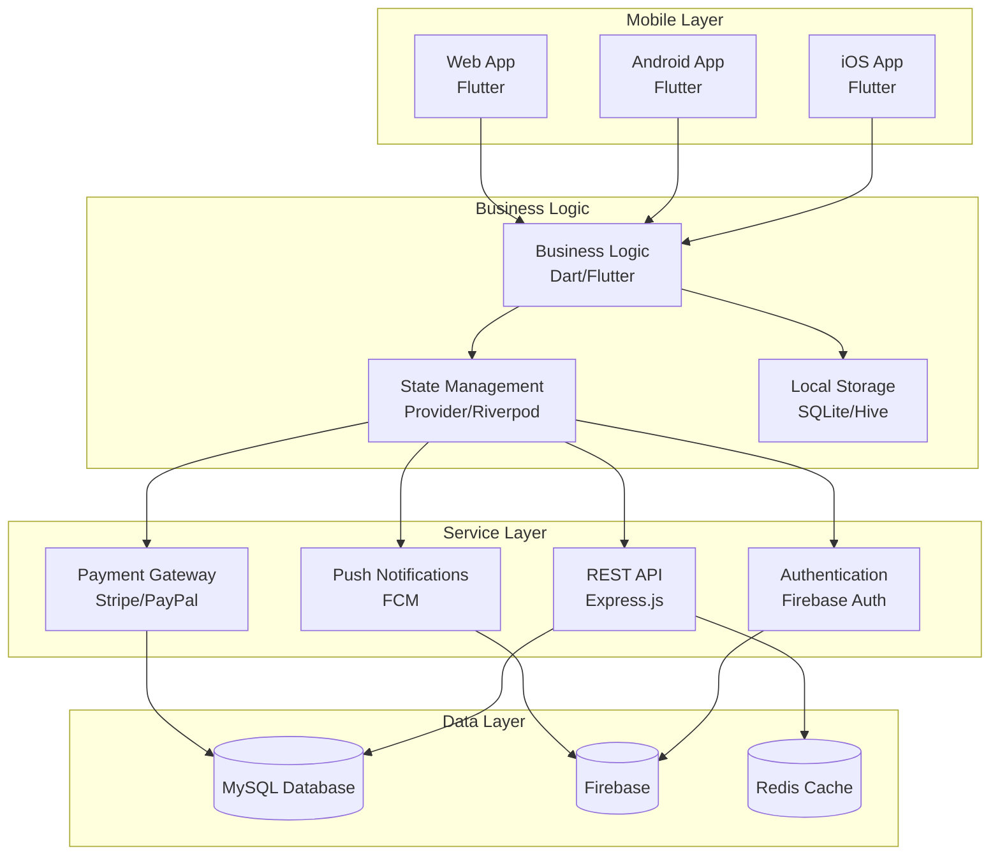

# 📱 Fayeed Auto Care - Mobile App Development Guide

> **Complete roadmap for transforming web application into production-ready mobile apps**

This comprehensive guide provides everything needed to develop, deploy, and maintain cross-platform mobile applications for Fayeed Auto Care using Flutter, including detailed specifications, architecture decisions, development workflows, and deployment strategies.

[](https://flutter.dev/)
[](https://flutter.dev/)
[](../LICENSE)
[](https://github.com/fayeedautocare)

---

## 📋 Table of Contents

- [🎯 Project Overview](#-project-overview)
- [📱 Mobile App Strategy](#-mobile-app-strategy)
- [🏗️ Technical Architecture](#️-technical-architecture)
- [✨ Feature Specifications](#-feature-specifications)
- [🎨 UI/UX Design System](#-uiux-design-system)
- [🚀 Development Approaches](#-development-approaches)
- [📦 Required Integrations](#-required-integrations)
- [🔧 Development Environment](#-development-environment)
- [📲 App Store Strategy](#-app-store-strategy)
- [🔒 Security & Privacy](#-security--privacy)
- [🚀 Deployment Guide](#-deployment-guide)
- [📈 Analytics & Monitoring](#-analytics--monitoring)
- [💰 Business Model](#-business-model)
- [📅 Development Timeline](#-development-timeline)
- [🤝 Team & Resources](#-team--resources)

---

## 🎯 Project Overview

### 🌟 **Vision Statement**
Transform the traditional car wash experience into a seamless, technology-driven service that customers can access anytime, anywhere through their mobile devices.

### 🎯 **Mission**
Create a world-class mobile application that enhances customer satisfaction, streamlines operations, and drives business growth through innovative features like QR code scanning, smart booking, and personalized service experiences.

### 📊 **Market Analysis**

#### **Target Market**
- **Primary**: Car owners in Zamboanga City (18-45 years)
- **Secondary**: Fleet managers and commercial vehicle operators
- **Tertiary**: Tourists and occasional car wash users

#### **Market Size**
- **Local Market**: 50,000+ registered vehicles in Zamboanga City
- **Target Users**: 10,000+ active monthly users (Year 1)
- **Revenue Potential**: ₱2M+ monthly recurring revenue

#### **Competitive Advantage**
- **First-mover**: Only QR-enabled car wash app in the region
- **Technology**: Advanced mobile-first experience
- **Convenience**: Home service and contactless experience
- **Loyalty**: Comprehensive membership and rewards system

### 🎯 **Business Objectives**

#### **Year 1 Goals**
- 📱 Launch iOS and Android apps
- 👥 Acquire 10,000+ active users
- 💰 ₱2M+ in mobile-driven revenue
- ⭐ 4.5+ app store rating
- 🏆 Market leadership in Zamboanga City

#### **Year 2-3 Goals**
- 🌍 Expand to other cities in Mindanao
- 🤝 Partner with other car care services
- 🚀 Introduce AI-powered features
- 📈 100,000+ users across the region

---

## 📱 Mobile App Strategy

### 📲 **Multi-Platform Approach**

#### **Primary Platforms**
1. **iOS App** (iPhone/iPad)
   - Target: Premium segment
   - Features: Apple Pay, Biometric auth
   - Revenue: 40% of mobile revenue

2. **Android App** (Phone/Tablet)
   - Target: Mass market
   - Features: Google Pay, Wide device support
   - Revenue: 55% of mobile revenue

3. **Progressive Web App**
   - Target: Web users, older devices
   - Features: App-like experience in browser
   - Revenue: 5% of mobile revenue

#### **Development Strategy**
- **Flutter Framework** for cross-platform efficiency
- **Single Codebase** for iOS, Android, and Web
- **Native Performance** with platform-specific optimizations
- **Rapid Deployment** with shared business logic

### 🎯 **User Experience Strategy**

#### **Customer Journey Optimization**


#### **Key Success Metrics**
- **Acquisition**: App downloads and registrations
- **Activation**: First booking completion rate
- **Retention**: Monthly active users
- **Revenue**: In-app purchases and subscriptions
- **Referral**: User recommendation rate

---

## 🏗️ Technical Architecture

### 🔧 **System Architecture**



### 🔧 **Technology Stack**

#### **Frontend (Mobile)**
| Component | Technology | Version | Purpose |
|-----------|------------|---------|---------|
| **Framework** | Flutter | 3.16+ | Cross-platform UI |
| **Language** | Dart | 3.0+ | Programming language |
| **State Management** | Provider/Riverpod | 6.0+ | App state management |
| **Local Database** | SQLite | 3.35+ | Offline data storage |
| **HTTP Client** | Dio | 5.0+ | API communication |
| **Maps** | Google Maps | 2.5+ | Location services |
| **Camera** | Camera Plugin | 0.10+ | QR code scanning |

#### **Backend Integration**
| Service | Provider | Purpose |
|---------|----------|---------|
| **Authentication** | Firebase Auth | User management |
| **Push Notifications** | Firebase Messaging | Real-time alerts |
| **Analytics** | Firebase Analytics | User behavior tracking |
| **Crash Reporting** | Firebase Crashlytics | Error monitoring |
| **API Backend** | Express.js | Business logic |
| **Database** | MySQL | Data persistence |
| **File Storage** | Firebase Storage | Image/document storage |

### 📁 **Project Structure**

```
mobile_app/
├── lib/
│   ├── main.dart                    # Application entry point
│   ├── app/                         # App-level configuration
│   │   ├── app.dart                # Main app widget
│   │   ├── router/                 # Navigation setup
│   │   ├── theme/                  # App theming
│   │   └── constants/              # App constants
│   ├── core/                       # Core functionality
│   │   ├── network/                # HTTP client setup
│   │   ├── database/               # Local database
│   │   ├── services/               # Core services
│   │   ├── utils/                  # Utility functions
│   │   ├── error/                  # Error handling
│   │   └── extensions/             # Dart extensions
│   ├── features/                   # Feature modules
│   │   ├── auth/                   # Authentication
│   │   │   ├── data/              # Data layer
│   │   │   ├── domain/            # Business logic
│   │   │   └── presentation/      # UI layer
│   │   ├── onboarding/            # User onboarding
│   │   ├── dashboard/             # Main dashboard
│   │   ├── booking/               # Booking system
│   │   ├── qr_scanner/            # QR code scanning
│   │   ├── payment/               # Payment processing
│   │   ├── membership/            # Subscription management
│   │   ├── profile/               # User profile
│   │   ├── vehicles/              # Vehicle management
│   │   ├── history/               # Service history
│   │   ├── notifications/         # Push notifications
│   │   └── settings/              # App settings
│   ├── shared/                    # Shared components
│   │   ├── widgets/               # Reusable UI components
│   │   ├── models/                # Data models
│   │   ├── providers/             # Shared state providers
│   │   ├── repositories/          # Data repositories
│   │   └── services/              # Shared services
│   └── generated/                 # Generated files
├── assets/                        # Static assets
│   ├── images/                    # Image assets
│   ├── icons/                     # App icons
│   ├── fonts/                     # Custom fonts
│   ├── animations/                # Lottie animations
│   └── sounds/                    # Audio files
├── test/                         # Unit tests
├── integration_test/             # Integration tests
├── android/                      # Android-specific code
├── ios/                         # iOS-specific code
├── web/                         # Web-specific code
└── docs/                        # Documentation
```

---

## ✨ Feature Specifications

### 🔐 **Authentication & User Management**

#### **Feature Overview**
Comprehensive user authentication system with multiple login options and secure session management.

#### **User Stories**
- As a new user, I want to register quickly with minimal information
- As a returning user, I want to login securely with biometric authentication
- As a user, I want to reset my password if I forget it
- As a user, I want to manage my account preferences

#### **Technical Requirements**

**Registration Flow:**
```dart
class RegistrationFlow {
  // Step 1: Basic Information
  - Full name (required, min 2 chars)
  - Email address (required, valid format)
  - Phone number (required, PH format)
  - Password (required, 8+ chars, mixed case)
  
  // Step 2: Email Verification
  - Send OTP via email
  - Verify OTP within 10 minutes
  - Fallback to SMS if email fails
  
  // Step 3: Profile Setup
  - Profile photo (optional)
  - Address (required for home service)
  - Notification preferences
  - Marketing consent
}
```

**Authentication Methods:**
- **Email/Password** - Primary method
- **Biometric** - Fingerprint, Face ID, Pattern
- **Social Login** - Google, Facebook (optional)
- **Phone Number** - SMS OTP verification

**Security Features:**
- JWT tokens with refresh mechanism
- Secure local storage (Keychain/Keystore)
- Session timeout after inactivity
- Device registration and management
- Suspicious activity detection

### 📱 **QR Code System** (Primary Feature)

#### **Feature Overview**
Advanced QR code scanning system for contactless branch check-in and service activation.

#### **User Stories**
- As a customer, I want to check-in quickly by scanning a QR code
- As a customer, I want to activate my service without waiting in line
- As a staff member, I want to verify customer check-ins in real-time
- As a manager, I want to track check-in analytics

#### **Technical Implementation**

**QR Scanner Interface:**
```dart
class QRScannerWidget extends StatefulWidget {
  @override
  Widget build(BuildContext context) {
    return Scaffold(
      body: Stack(
        children: [
          // Full-screen camera preview
          QRView(
            key: qrKey,
            onQRViewCreated: _onQRViewCreated,
            overlay: QrScannerOverlayShape(
              borderColor: Colors.orange,
              borderRadius: 10,
              borderLength: 30,
              borderWidth: 10,
              cutOutSize: 300,
            ),
          ),
          
          // Scanning instructions
          _buildInstructions(),
          
          // Flash toggle button
          _buildFlashButton(),
          
          // Manual QR entry option
          _buildManualEntryButton(),
        ],
      ),
    );
  }
}
```

**QR Code Types:**

1. **Branch Check-in QR Codes**
   ```
   Format: "branch_{branchId}_{timestamp}"
   Example: "branch_tumaga_20240120103000"
   
   Processing Flow:
   1. Parse QR code data
   2. Validate branch existence
   3. Check branch operating hours
   4. Verify user location (within 100m radius)
   5. Update user check-in status
   6. Show check-in confirmation
   7. Send notification to staff
   ```

2. **Service Activation QR Codes**
   ```
   Format: "service_{serviceId}_{branchId}"
   Example: "service_classic_wash_tumaga"
   
   Processing Flow:
   1. Verify user check-in status
   2. Check membership validity
   3. Deduct service from package/credits
   4. Start service timer
   5. Notify staff of service start
   6. Show service confirmation to user
   ```

**Location Verification:**
```dart
Future<bool> verifyLocationForCheckIn(String branchId) async {
  final position = await Geolocator.getCurrentPosition();
  final branch = await _branchRepository.getBranchById(branchId);
  
  final distance = Geolocator.distanceBetween(
    position.latitude,
    position.longitude,
    branch.latitude,
    branch.longitude,
  );
  
  // Allow check-in within 100 meters
  return distance <= 100;
}
```

### 📅 **Smart Booking System**

#### **Feature Overview**
Intuitive 4-step booking wizard with real-time availability and intelligent recommendations.

#### **Booking Flow**

**Step 1: Service Selection**
```dart
class ServiceSelectionStep extends StatelessWidget {
  Widget build(BuildContext context) {
    return Column(
      children: [
        // Service categories
        _buildServiceCategories(),
        
        // Featured services
        _buildFeaturedServices(),
        
        // Service list with prices
        _buildServiceList(),
        
        // Add-on services
        _buildAddOnServices(),
      ],
    );
  }
}
```

**Step 2: Vehicle Selection**
```dart
class VehicleSelectionStep extends StatelessWidget {
  Widget build(BuildContext context) {
    return Column(
      children: [
        // Saved vehicles
        _buildSavedVehicles(),
        
        // Add new vehicle option
        _buildAddVehicleOption(),
        
        // Vehicle details form
        if (showAddVehicleForm) _buildVehicleForm(),
        
        // Service price adjustment based on vehicle type
        _buildPriceBreakdown(),
      ],
    );
  }
}
```

**Step 3: Date & Time Selection**
```dart
class DateTimeSelectionStep extends StatelessWidget {
  Widget build(BuildContext context) {
    return Column(
      children: [
        // Branch selection
        _buildBranchSelector(),
        
        // Calendar view
        _buildCalendarView(),
        
        // Available time slots
        _buildTimeSlots(),
        
        // Home service option
        _buildHomeServiceOption(),
        
        // Special instructions
        _buildSpecialInstructions(),
      ],
    );
  }
}
```

**Step 4: Payment & Confirmation**
```dart
class PaymentConfirmationStep extends StatelessWidget {
  Widget build(BuildContext context) {
    return Column(
      children: [
        // Booking summary
        _buildBookingSummary(),
        
        // Payment method selection
        _buildPaymentMethods(),
        
        // Membership credit option
        _buildMembershipCredits(),
        
        // Promo code input
        _buildPromoCodeInput(),
        
        // Terms and conditions
        _buildTermsAgreement(),
        
        // Confirm booking button
        _buildConfirmButton(),
      ],
    );
  }
}
```

#### **Real-time Availability**
```dart
Future<List<TimeSlot>> getAvailableSlots(
  String branchId,
  DateTime date,
  int serviceDuration,
) async {
  final response = await _apiClient.get(
    '/branches/$branchId/availability',
    queryParameters: {
      'date': date.toIso8601String(),
      'duration': serviceDuration,
    },
  );
  
  return (response.data as List)
      .map((slot) => TimeSlot.fromJson(slot))
      .toList();
}
```

### 💳 **Payment Integration**

#### **Supported Payment Methods**

1. **Credit/Debit Cards**
   - Visa, Mastercard, American Express
   - Local Philippine banks
   - Secure tokenization

2. **Digital Wallets**
   - GCash integration
   - PayMaya support
   - Apple Pay (iOS)
   - Google Pay (Android)

3. **Membership Credits**
   - Subscription-based credits
   - Loyalty point redemption
   - Promotional vouchers

#### **Payment Flow Implementation**
```dart
class PaymentService {
  Future<PaymentResult> processPayment({
    required double amount,
    required PaymentMethod method,
    required String bookingId,
  }) async {
    switch (method.type) {
      case PaymentMethodType.creditCard:
        return await _processCardPayment(amount, method, bookingId);
      case PaymentMethodType.gcash:
        return await _processGCashPayment(amount, method, bookingId);
      case PaymentMethodType.membershipCredit:
        return await _processMembershipCredit(amount, method, bookingId);
      default:
        throw UnsupportedPaymentMethodException(method.type);
    }
  }
}
```

### 👑 **Membership System**

#### **Membership Tiers**

| Tier | Monthly Price | Benefits |
|------|---------------|----------|
| **Regular** | Free | Basic booking, standard pricing |
| **Classic Pro** | ₱500 | 4 classic washes, 10% discount on add-ons |
| **VIP Silver** | ₱1,500 | Unlimited basic washes, 2 premium services |
| **VIP Gold** | ₱3,000 | Unlimited all services, home service included |

#### **Membership Features**
```dart
class MembershipService {
  // Check membership benefits
  Future<MembershipBenefits> getMembershipBenefits(String userId) async {
    final membership = await _membershipRepository.getActiveMembership(userId);
    
    return MembershipBenefits(
      tier: membership.tier,
      remainingServices: membership.remainingServices,
      discountPercentage: membership.discountPercentage,
      priorityBooking: membership.priorityBooking,
      homeServiceIncluded: membership.homeServiceIncluded,
    );
  }
  
  // Deduct service from membership
  Future<void> deductService(String userId, String serviceId) async {
    final membership = await _membershipRepository.getActiveMembership(userId);
    
    if (membership.canUseService(serviceId)) {
      await _membershipRepository.deductService(membership.id, serviceId);
      await _analyticsService.logServiceUsage(userId, serviceId);
    } else {
      throw InsufficientMembershipCreditsException();
    }
  }
}
```

### 📊 **Personal Dashboard**

#### **Dashboard Widgets**

**Welcome Section:**
```dart
class WelcomeSection extends StatelessWidget {
  Widget build(BuildContext context) {
    return Card(
      child: Padding(
        padding: EdgeInsets.all(16),
        child: Column(
          crossAxisAlignment: CrossAxisAlignment.start,
          children: [
            Text('Good morning, ${user.firstName}!'),
            Text('Your next wash is in 3 days'),
            _buildWeatherWidget(),
            _buildQuickActions(),
          ],
        ),
      ),
    );
  }
}
```

**Membership Status:**
```dart
class MembershipStatusWidget extends StatelessWidget {
  Widget build(BuildContext context) {
    return Card(
      child: Column(
        children: [
          _buildMembershipTier(),
          _buildRemainingServices(),
          _buildRenewalDate(),
          _buildUpgradeOption(),
        ],
      ),
    );
  }
}
```

**Usage Analytics:**
```dart
class UsageAnalyticsWidget extends StatelessWidget {
  Widget build(BuildContext context) {
    return Card(
      child: Column(
        children: [
          _buildMonthlySpending(),
          _buildServiceFrequency(),
          _buildCarbonFootprint(),
          _buildLoyaltyPoints(),
        ],
      ),
    );
  }
}
```

---

## �� UI/UX Design System

### 🎨 **Brand Identity**

#### **Color Palette**
```dart
class AppColors {
  // Primary Colors
  static const Color primary = Color(0xFFFF6B35);          // FAC Orange
  static const Color primaryLight = Color(0xFFFF8A65);     // Light Orange
  static const Color primaryDark = Color(0xFFE65100);      // Dark Orange
  
  // Secondary Colors
  static const Color secondary = Color(0xFF6C5CE7);        // Purple
  static const Color secondaryLight = Color(0xFF9B7FE8);   // Light Purple
  static const Color secondaryDark = Color(0xFF5A4FCF);    // Dark Purple
  
  // Accent Colors
  static const Color accent = Color(0xFF00D4AA);           // Teal
  static const Color accentLight = Color(0xFF33E0C0);      // Light Teal
  static const Color accentDark = Color(0xFF00B894);       // Dark Teal
  
  // Neutral Colors
  static const Color surface = Color(0xFFFFFFFF);          // White
  static const Color background = Color(0xFFF8F9FA);       // Light Gray
  static const Color surfaceVariant = Color(0xFFF5F5F5);   // Gray
  
  // Text Colors
  static const Color textPrimary = Color(0xFF2D3436);      // Dark Gray
  static const Color textSecondary = Color(0xFF636E72);    // Medium Gray
  static const Color textTertiary = Color(0xFF95A5A6);     // Light Gray
  
  // Status Colors
  static const Color success = Color(0xFF2ECC71);          // Green
  static const Color warning = Color(0xFFF39C12);          // Orange
  static const Color error = Color(0xFFE74C3C);            // Red
  static const Color info = Color(0xFF3498DB);             // Blue
}
```

#### **Typography System**
```dart
class AppTextStyles {
  static const String _fontFamily = 'Poppins';
  
  // Headlines
  static const TextStyle headline1 = TextStyle(
    fontFamily: _fontFamily,
    fontSize: 32,
    fontWeight: FontWeight.bold,
    letterSpacing: -0.5,
  );
  
  static const TextStyle headline2 = TextStyle(
    fontFamily: _fontFamily,
    fontSize: 24,
    fontWeight: FontWeight.w600,
    letterSpacing: -0.25,
  );
  
  static const TextStyle headline3 = TextStyle(
    fontFamily: _fontFamily,
    fontSize: 20,
    fontWeight: FontWeight.w600,
    letterSpacing: 0,
  );
  
  // Body Text
  static const TextStyle bodyLarge = TextStyle(
    fontFamily: _fontFamily,
    fontSize: 16,
    fontWeight: FontWeight.normal,
    letterSpacing: 0.15,
  );
  
  static const TextStyle bodyMedium = TextStyle(
    fontFamily: _fontFamily,
    fontSize: 14,
    fontWeight: FontWeight.normal,
    letterSpacing: 0.25,
  );
  
  // Buttons and Labels
  static const TextStyle buttonLarge = TextStyle(
    fontFamily: _fontFamily,
    fontSize: 16,
    fontWeight: FontWeight.w600,
    letterSpacing: 0.5,
  );
  
  static const TextStyle caption = TextStyle(
    fontFamily: _fontFamily,
    fontSize: 12,
    fontWeight: FontWeight.normal,
    letterSpacing: 0.4,
  );
}
```

### 🎨 **Component Design**

#### **Button System**
```dart
class AppButton extends StatelessWidget {
  final String text;
  final VoidCallback? onPressed;
  final ButtonType type;
  final ButtonSize size;
  final bool isLoading;
  
  Widget build(BuildContext context) {
    return AnimatedContainer(
      duration: Duration(milliseconds: 200),
      child: ElevatedButton(
        onPressed: isLoading ? null : onPressed,
        style: _getButtonStyle(type, size),
        child: isLoading 
          ? CircularProgressIndicator()
          : Text(text, style: _getTextStyle(type, size)),
      ),
    );
  }
}

enum ButtonType { primary, secondary, tertiary, danger }
enum ButtonSize { small, medium, large }
```

#### **Card Components**
```dart
class ServiceCard extends StatelessWidget {
  final Service service;
  final bool isSelected;
  final VoidCallback onTap;
  
  Widget build(BuildContext context) {
    return Card(
      elevation: isSelected ? 8 : 2,
      child: InkWell(
        onTap: onTap,
        borderRadius: BorderRadius.circular(12),
        child: Padding(
          padding: EdgeInsets.all(16),
          child: Column(
            crossAxisAlignment: CrossAxisAlignment.start,
            children: [
              _buildServiceIcon(),
              SizedBox(height: 12),
              _buildServiceTitle(),
              _buildServiceDescription(),
              SizedBox(height: 8),
              _buildServicePrice(),
              _buildServiceDuration(),
            ],
          ),
        ),
      ),
    );
  }
}
```

### 📱 **Screen Templates**

#### **List Screen Template**
```dart
class ListScreenTemplate<T> extends StatelessWidget {
  final String title;
  final List<T> items;
  final Widget Function(T item) itemBuilder;
  final VoidCallback? onRefresh;
  final bool isLoading;
  
  Widget build(BuildContext context) {
    return Scaffold(
      appBar: AppBar(title: Text(title)),
      body: RefreshIndicator(
        onRefresh: onRefresh ?? () async {},
        child: isLoading
          ? _buildLoadingState()
          : ListView.builder(
              itemCount: items.length,
              itemBuilder: (context, index) => itemBuilder(items[index]),
            ),
      ),
    );
  }
}
```

#### **Form Screen Template**
```dart
class FormScreenTemplate extends StatefulWidget {
  final String title;
  final List<FormField> fields;
  final VoidCallback onSubmit;
  final bool isLoading;
  
  Widget build(BuildContext context) {
    return Scaffold(
      appBar: AppBar(title: Text(title)),
      body: Form(
        key: _formKey,
        child: Column(
          children: [
            Expanded(
              child: ListView(
                padding: EdgeInsets.all(16),
                children: fields.map(_buildFormField).toList(),
              ),
            ),
            _buildSubmitButton(),
          ],
        ),
      ),
    );
  }
}
```

---

## 🚀 Development Approaches

### 🎯 **Option 1: Flutter (Recommended)**

#### **Advantages**
- **Single Codebase**: Write once, deploy to iOS, Android, and Web
- **Native Performance**: Compiled to native ARM code
- **Rich UI Framework**: Extensive widget library
- **Growing Ecosystem**: Strong community and package ecosystem
- **Cost-Effective**: Reduced development and maintenance costs

#### **Disadvantages**
- **Learning Curve**: Team may need Flutter/Dart training
- **App Size**: Slightly larger app size than native
- **Platform Limitations**: Some platform-specific features require custom implementation

#### **Development Timeline**
- **Setup & Planning**: 2 weeks
- **Core Features**: 8 weeks
- **Testing & Polish**: 4 weeks
- **Store Submission**: 2 weeks
- **Total**: 16 weeks (4 months)

#### **Team Requirements**
- 2 Flutter developers
- 1 UI/UX designer
- 1 Backend developer
- 1 Project manager
- 1 QA tester

### 🎯 **Option 2: FlutterFlow (Rapid Prototyping)**

#### **Advantages**
- **Visual Development**: Drag-and-drop UI builder
- **Rapid Prototyping**: Quick MVP development
- **Built-in Integrations**: Firebase, APIs, payments
- **No-Code/Low-Code**: Less coding required

#### **Disadvantages**
- **Platform Lock-in**: Dependent on FlutterFlow platform
- **Customization Limits**: Limited custom logic capabilities
- **Subscription Cost**: Ongoing platform costs
- **Export Limitations**: Generated code may be hard to maintain

#### **When to Use**
- Rapid MVP development
- Budget constraints
- Non-technical team
- Quick market validation

### 🎯 **Option 3: Native Development**

#### **Advantages**
- **Maximum Performance**: Best possible performance
- **Platform Features**: Full access to platform APIs
- **Mature Ecosystem**: Established development tools

#### **Disadvantages**
- **Higher Cost**: Separate development for each platform
- **Longer Timeline**: Double development effort
- **Maintenance Overhead**: Multiple codebases to maintain

#### **When to Consider**
- Performance is critical
- Heavy platform-specific features needed
- Large development budget available

---

## 📦 Required Integrations

### 🔐 **Authentication & Security**

#### **Firebase Authentication**
```yaml
# pubspec.yaml
dependencies:
  firebase_auth: ^4.15.2
  firebase_core: ^2.24.2
  google_sign_in: ^6.1.5
  local_auth: ^2.1.7
```

```dart
// Implementation
class AuthService {
  final FirebaseAuth _auth = FirebaseAuth.instance;
  
  Future<User?> signInWithEmail(String email, String password) async {
    try {
      final credential = await _auth.signInWithEmailAndPassword(
        email: email,
        password: password,
      );
      return credential.user;
    } catch (e) {
      throw AuthException(e.toString());
    }
  }
  
  Future<void> signOut() async {
    await _auth.signOut();
  }
}
```

### 📱 **Camera & QR Scanner**

#### **QR Code Scanner Package**
```yaml
dependencies:
  qr_code_scanner: ^1.0.1
  permission_handler: ^11.0.1
```

```dart
class QRScannerService {
  QRViewController? controller;
  
  void onQRViewCreated(QRViewController controller) {
    this.controller = controller;
    controller.scannedDataStream.listen((scanData) {
      _handleQRScan(scanData.code);
    });
  }
  
  Future<void> _handleQRScan(String? qrData) async {
    if (qrData != null) {
      await _processQRCode(qrData);
    }
  }
}
```

### 💳 **Payment Processing**

#### **Stripe Integration**
```yaml
dependencies:
  stripe_payment: ^1.1.4
```

```dart
class PaymentService {
  Future<PaymentResult> processStripePayment({
    required double amount,
    required String currency,
  }) async {
    try {
      final paymentIntent = await Stripe.instance.createPaymentMethod(
        params: PaymentMethodParams.card(
          paymentMethodData: PaymentMethodData(
            billingDetails: BillingDetails(/* ... */),
          ),
        ),
      );
      
      return PaymentResult.success(paymentIntent.id);
    } catch (e) {
      return PaymentResult.error(e.toString());
    }
  }
}
```

### 📍 **Maps & Location**

#### **Google Maps Integration**
```yaml
dependencies:
  google_maps_flutter: ^2.5.0
  geolocator: ^10.1.0
  geocoding: ^2.1.1
```

```dart
class LocationService {
  Future<Position> getCurrentLocation() async {
    bool serviceEnabled = await Geolocator.isLocationServiceEnabled();
    if (!serviceEnabled) {
      throw LocationServiceDisabledException();
    }
    
    LocationPermission permission = await Geolocator.checkPermission();
    if (permission == LocationPermission.denied) {
      permission = await Geolocator.requestPermission();
    }
    
    return await Geolocator.getCurrentPosition();
  }
  
  Future<double> getDistanceBetween(
    double lat1, double lon1,
    double lat2, double lon2,
  ) async {
    return Geolocator.distanceBetween(lat1, lon1, lat2, lon2);
  }
}
```

### 🔔 **Push Notifications**

#### **Firebase Messaging**
```yaml
dependencies:
  firebase_messaging: ^14.7.8
  flutter_local_notifications: ^16.3.0
```

```dart
class NotificationService {
  final FirebaseMessaging _messaging = FirebaseMessaging.instance;
  
  Future<void> initialize() async {
    // Request permission
    await _messaging.requestPermission();
    
    // Get FCM token
    String? token = await _messaging.getToken();
    await _sendTokenToServer(token);
    
    // Handle foreground messages
    FirebaseMessaging.onMessage.listen(_handleForegroundMessage);
    
    // Handle background messages
    FirebaseMessaging.onBackgroundMessage(_handleBackgroundMessage);
  }
  
  Future<void> _handleForegroundMessage(RemoteMessage message) async {
    await _showLocalNotification(message);
  }
}
```

---

## 🔧 Development Environment

### 🛠️ **Development Setup**

#### **Required Tools**
```bash
# Flutter SDK
flutter --version

# IDE (Choose one)
# Android Studio with Flutter plugin
# VS Code with Flutter extension

# Platform Tools
# Xcode (macOS, for iOS development)
# Android SDK (for Android development)

# Version Control
git --version

# Package Manager
dart pub --version
```

#### **Environment Configuration**

**Development Environment:**
```yaml
# pubspec.yaml
environment:
  sdk: '>=3.0.0 <4.0.0'
  flutter: '>=3.16.0'

dev_dependencies:
  flutter_test:
    sdk: flutter
  flutter_lints: ^3.0.1
  build_runner: ^2.4.7
  mockito: ^5.4.4
  integration_test:
    sdk: flutter
```

**Configuration Files:**
```dart
// lib/config/environment.dart
class Environment {
  static const String apiBaseUrl = String.fromEnvironment(
    'API_BASE_URL',
    defaultValue: 'http://localhost:3000/api',
  );
  
  static const String stripePublishableKey = String.fromEnvironment(
    'STRIPE_PUBLISHABLE_KEY',
    defaultValue: 'pk_test_...',
  );
  
  static const bool isProduction = bool.fromEnvironment('PRODUCTION');
}
```

### 🧪 **Testing Strategy**

#### **Unit Tests**
```dart
// test/services/auth_service_test.dart
void main() {
  group('AuthService', () {
    late AuthService authService;
    late MockFirebaseAuth mockAuth;
    
    setUp(() {
      mockAuth = MockFirebaseAuth();
      authService = AuthService(mockAuth);
    });
    
    test('should sign in user successfully', () async {
      // Arrange
      const email = 'test@example.com';
      const password = 'password123';
      final mockUser = MockUser();
      
      when(mockAuth.signInWithEmailAndPassword(
        email: email,
        password: password,
      )).thenAnswer((_) async => MockUserCredential(mockUser));
      
      // Act
      final result = await authService.signInWithEmail(email, password);
      
      // Assert
      expect(result, equals(mockUser));
    });
  });
}
```

#### **Widget Tests**
```dart
// test/widgets/service_card_test.dart
void main() {
  testWidgets('ServiceCard displays service information', (tester) async {
    const service = Service(
      id: '1',
      name: 'Car Wash',
      price: 250.0,
      duration: 30,
    );
    
    await tester.pumpWidget(
      MaterialApp(
        home: ServiceCard(service: service),
      ),
    );
    
    expect(find.text('Car Wash'), findsOneWidget);
    expect(find.text('₱250'), findsOneWidget);
    expect(find.text('30 min'), findsOneWidget);
  });
}
```

#### **Integration Tests**
```dart
// integration_test/app_test.dart
void main() {
  group('App Integration Tests', () {
    testWidgets('Complete booking flow', (tester) async {
      app.main();
      await tester.pumpAndSettle();
      
      // Login
      await tester.tap(find.byKey(Key('login_button')));
      await tester.pumpAndSettle();
      
      // Navigate to booking
      await tester.tap(find.byKey(Key('book_service_button')));
      await tester.pumpAndSettle();
      
      // Select service
      await tester.tap(find.byKey(Key('car_wash_service')));
      await tester.pumpAndSettle();
      
      // Complete booking
      await tester.tap(find.byKey(Key('confirm_booking')));
      await tester.pumpAndSettle();
      
      // Verify booking confirmation
      expect(find.text('Booking Confirmed'), findsOneWidget);
    });
  });
}
```

### 🚀 **Build Configuration**

#### **Build Scripts**
```yaml
# scripts/build.yaml
name: Build Scripts
description: Automated build scripts for different environments

scripts:
  build_dev: flutter build apk --debug
  build_staging: flutter build apk --release --dart-define=ENVIRONMENT=staging
  build_prod: flutter build apk --release --dart-define=ENVIRONMENT=production
  
  test_unit: flutter test
  test_integration: flutter test integration_test/
  test_all: flutter test && flutter test integration_test/
  
  analyze: flutter analyze
  format: dart format .
```

#### **CI/CD Pipeline**
```yaml
# .github/workflows/flutter.yml
name: Flutter CI/CD

on:
  push:
    branches: [ main, develop ]
  pull_request:
    branches: [ main ]

jobs:
  test:
    runs-on: ubuntu-latest
    steps:
    - uses: actions/checkout@v3
    - uses: subosito/flutter-action@v2
      with:
        flutter-version: '3.16.0'
    
    - name: Install dependencies
      run: flutter pub get
    
    - name: Run tests
      run: flutter test
    
    - name: Analyze code
      run: flutter analyze

  build:
    needs: test
    runs-on: ubuntu-latest
    steps:
    - uses: actions/checkout@v3
    - uses: subosito/flutter-action@v2
    
    - name: Build APK
      run: flutter build apk --release
    
    - name: Upload artifacts
      uses: actions/upload-artifact@v3
      with:
        name: app-release.apk
        path: build/app/outputs/flutter-apk/app-release.apk
```

---

## 📲 App Store Strategy

### 🎯 **App Store Optimization (ASO)**

#### **App Metadata**

**App Name:**
- Primary: "Fayeed Auto Care"
- With Keywords: "Fayeed Auto Care - Car Wash Booking"

**App Description:**
```
🚗 FAYEED AUTO CARE - Premium Car Wash Experience

Transform your car care routine with our innovative mobile app featuring:

🎯 QR CODE SCANNING
• Instant branch check-in with your camera
• Quick service activation - no waiting in lines
• Seamless contactless experience

📅 SMART BOOKING SYSTEM
• Easy 4-step booking wizard
• Real-time availability across all branches
• Multiple vehicle management

💳 FLEXIBLE PAYMENT OPTIONS
• Secure credit/debit card processing
• Digital wallets (GCash, PayMaya, Apple Pay)
• Membership credit system

👑 MEMBERSHIP BENEFITS
• 4 tiers: Regular, Classic, VIP Silver, VIP Gold
• Unlimited monthly washes
• Priority booking and exclusive discounts

📍 CONVENIENT LOCATIONS
• Fayeed Auto Care - Tumaga Branch
• Fayeed Auto Care - Boalan Branch
• GPS navigation to nearest location

Download now and experience the future of car care! 🌟
```

**Keywords:**
- Primary: car wash, auto care, car cleaning
- Secondary: mobile booking, QR code, membership
- Local: Zamboanga City, Philippines, auto detailing

#### **App Store Assets**

**App Icons:**
- iOS: 1024×1024 PNG
- Android: 512×512 PNG
- Rounded corners, vibrant FAC orange
- Clear, recognizable brand symbol

**Screenshots:**
| Platform | Device | Size | Purpose |
|----------|--------|------|---------|
| iOS | iPhone 6.7" | 1290×2796 | Primary screenshots |
| iOS | iPhone 6.5" | 1242×2688 | Older devices |
| iOS | iPad Pro | 2048×2732 | Tablet experience |
| Android | Phone | 1080×1920 | Standard size |
| Android | Tablet | 1200×1920 | Tablet experience |

**App Preview Video:**
- Duration: 30 seconds maximum
- Showcase: QR scanning, booking flow, payment
- Style: Professional, modern, engaging
- Call-to-action: "Download and start washing!"

### 📈 **Launch Strategy**

#### **Soft Launch Phase (Weeks 1-2)**
- **Target**: Internal testers and beta users
- **Features**: Core functionality only
- **Feedback**: Collect user feedback and fix critical issues
- **Metrics**: Crash-free sessions, user retention

#### **Limited Launch Phase (Weeks 3-4)**
- **Target**: Existing Fayeed Auto Care customers
- **Features**: Full feature set
- **Promotion**: Email marketing to existing customer base
- **Metrics**: App downloads, booking conversion rate

#### **Public Launch Phase (Weeks 5-8)**
- **Target**: General public in Zamboanga City
- **Features**: All features with promotions
- **Promotion**: Social media, local advertising, influencer partnerships
- **Metrics**: Organic downloads, user acquisition cost

#### **Growth Phase (Weeks 9-12)**
- **Target**: Regional expansion
- **Features**: Enhanced features based on feedback
- **Promotion**: App store optimization, paid advertising
- **Metrics**: Monthly active users, revenue growth

### 💰 **Monetization Strategy**

#### **Revenue Streams**

1. **Service Bookings** (70% of revenue)
   - Commission on each booking
   - Platform fee for payment processing
   - Premium service markups

2. **Membership Subscriptions** (25% of revenue)
   - Monthly/annual subscription fees
   - Membership upgrade upselling
   - Corporate/fleet packages

3. **In-App Purchases** (5% of revenue)
   - Additional service vouchers
   - Premium features unlock
   - Loyalty point purchases

#### **Pricing Strategy**
```dart
class PricingModel {
  // Service Commission
  static const double serviceCommission = 0.05; // 5%
  
  // Membership Tiers
  static const Map<String, double> membershipPrices = {
    'classic_pro': 500.0,
    'vip_silver': 1500.0,
    'vip_gold': 3000.0,
  };
  
  // In-App Purchases
  static const Map<String, double> iapPrices = {
    'voucher_pack_5': 200.0,
    'voucher_pack_10': 350.0,
    'loyalty_points_1000': 100.0,
  };
}
```

---

## 🔒 Security & Privacy

### 🛡️ **Security Implementation**

#### **Data Encryption**
```dart
class EncryptionService {
  static const String _key = 'your-encryption-key-32-chars-long';
  
  Future<String> encrypt(String plainText) async {
    final key = encrypt.Key.fromBase64(_key);
    final iv = encrypt.IV.fromSecureRandom(16);
    final encrypter = encrypt.Encrypter(encrypt.AES(key));
    
    final encrypted = encrypter.encrypt(plainText, iv: iv);
    return encrypted.base64;
  }
  
  Future<String> decrypt(String encryptedText) async {
    final key = encrypt.Key.fromBase64(_key);
    final encrypter = encrypt.Encrypter(encrypt.AES(key));
    
    final encrypted = encrypt.Encrypted.fromBase64(encryptedText);
    return encrypter.decrypt(encrypted);
  }
}
```

#### **Secure Storage**
```dart
class SecureStorageService {
  static const FlutterSecureStorage _storage = FlutterSecureStorage(
    aOptions: AndroidOptions(
      encryptedSharedPreferences: true,
    ),
    iOptions: IOSOptions(
      accessibility: IOSAccessibility.first_unlock_this_device,
    ),
  );
  
  Future<void> storeToken(String token) async {
    await _storage.write(key: 'auth_token', value: token);
  }
  
  Future<String?> getToken() async {
    return await _storage.read(key: 'auth_token');
  }
}
```

#### **Biometric Authentication**
```dart
class BiometricAuthService {
  static const LocalAuthentication _localAuth = LocalAuthentication();
  
  Future<bool> isBiometricAvailable() async {
    final isAvailable = await _localAuth.canCheckBiometrics;
    final isDeviceSupported = await _localAuth.isDeviceSupported();
    return isAvailable && isDeviceSupported;
  }
  
  Future<bool> authenticateWithBiometrics() async {
    try {
      final isAuthenticated = await _localAuth.authenticate(
        localizedReason: 'Authenticate to access your account',
        options: AuthenticationOptions(
          biometricOnly: true,
          stickyAuth: true,
        ),
      );
      return isAuthenticated;
    } catch (e) {
      return false;
    }
  }
}
```

### 🔐 **Privacy Compliance**

#### **GDPR Compliance**
```dart
class PrivacyService {
  Future<void> requestDataDeletion(String userId) async {
    // Anonymize user data
    await _userRepository.anonymizeUser(userId);
    
    // Delete personal information
    await _userRepository.deletePersonalData(userId);
    
    // Notify backend services
    await _apiClient.post('/users/$userId/delete-data');
    
    // Log deletion request
    await _auditService.logDataDeletion(userId);
  }
  
  Future<Map<String, dynamic>> exportUserData(String userId) async {
    final userData = await _userRepository.getUserData(userId);
    final bookingData = await _bookingRepository.getUserBookings(userId);
    final paymentData = await _paymentRepository.getUserPayments(userId);
    
    return {
      'user_profile': userData,
      'bookings': bookingData,
      'payments': paymentData,
      'exported_at': DateTime.now().toIso8601String(),
    };
  }
}
```

#### **Permission Management**
```dart
class PermissionService {
  Future<bool> requestCameraPermission() async {
    final status = await Permission.camera.request();
    return status == PermissionStatus.granted;
  }
  
  Future<bool> requestLocationPermission() async {
    final status = await Permission.location.request();
    return status == PermissionStatus.granted;
  }
  
  Future<void> showPermissionRationale(Permission permission) async {
    final context = navigatorKey.currentContext!;
    
    await showDialog(
      context: context,
      builder: (context) => AlertDialog(
        title: Text('Permission Required'),
        content: Text(_getPermissionRationaleText(permission)),
        actions: [
          TextButton(
            onPressed: () => Navigator.pop(context),
            child: Text('Cancel'),
          ),
          TextButton(
            onPressed: () {
              Navigator.pop(context);
              openAppSettings();
            },
            child: Text('Settings'),
          ),
        ],
      ),
    );
  }
}
```

---

## 🚀 Deployment Guide

### 📦 **Build Process**

#### **Android Deployment**

**1. Prepare Release Build:**
```bash
# Generate keystore for signing
keytool -genkey -v -keystore ~/upload-keystore.jks -keyalg RSA -keysize 2048 -validity 10000 -alias upload

# Create key.properties file
echo "storePassword=your_keystore_password
keyPassword=your_key_password
keyAlias=upload
storeFile=/Users/your_username/upload-keystore.jks" > android/key.properties

# Build signed APK
flutter build apk --release

# Build App Bundle for Play Store
flutter build appbundle --release
```

**2. Upload to Google Play Console:**
```bash
# File locations
build/app/outputs/flutter-apk/app-release.apk        # APK for testing
build/app/outputs/bundle/release/app-release.aab     # AAB for Play Store

# Upload process:
# 1. Create app in Google Play Console
# 2. Upload AAB to Internal Testing
# 3. Complete store listing
# 4. Submit for review
```

#### **iOS Deployment**

**1. Prepare iOS Build:**
```bash
# Clean previous builds
flutter clean
flutter pub get

# Build iOS app
flutter build ios --release

# Open in Xcode for signing
open ios/Runner.xcworkspace
```

**2. Xcode Configuration:**
```bash
# In Xcode:
# 1. Select Runner project
# 2. Update Bundle Identifier
# 3. Configure Signing & Capabilities
# 4. Archive (Product → Archive)
# 5. Distribute to App Store Connect
```

### 🌐 **Environment Management**

#### **Development Environment**
```dart
// lib/config/dev_config.dart
class DevConfig {
  static const String apiBaseUrl = 'http://localhost:3000/api';
  static const String stripeKey = 'pk_test_...';
  static const bool enableLogging = true;
  static const bool enableAnalytics = false;
}
```

#### **Staging Environment**
```dart
// lib/config/staging_config.dart
class StagingConfig {
  static const String apiBaseUrl = 'https://staging-api.fayeedautocare.com';
  static const String stripeKey = 'pk_test_...';
  static const bool enableLogging = true;
  static const bool enableAnalytics = true;
}
```

#### **Production Environment**
```dart
// lib/config/prod_config.dart
class ProdConfig {
  static const String apiBaseUrl = 'https://api.fayeedautocare.com';
  static const String stripeKey = 'pk_live_...';
  static const bool enableLogging = false;
  static const bool enableAnalytics = true;
}
```

### 🔧 **Deployment Automation**

#### **GitHub Actions Workflow**
```yaml
name: Deploy Mobile App

on:
  push:
    tags:
      - 'v*'

jobs:
  deploy_android:
    runs-on: ubuntu-latest
    steps:
    - uses: actions/checkout@v3
    
    - name: Setup Flutter
      uses: subosito/flutter-action@v2
      with:
        flutter-version: '3.16.0'
    
    - name: Build APK
      run: flutter build apk --release
    
    - name: Upload to Play Store
      uses: r0adkll/upload-google-play@v1
      with:
        serviceAccountJsonPlainText: ${{ secrets.GOOGLE_PLAY_SERVICE_ACCOUNT }}
        packageName: com.fayeedautocare.app
        releaseFiles: build/app/outputs/bundle/release/app-release.aab
        track: production

  deploy_ios:
    runs-on: macos-latest
    steps:
    - uses: actions/checkout@v3
    
    - name: Setup Flutter
      uses: subosito/flutter-action@v2
    
    - name: Build iOS
      run: flutter build ios --release --no-codesign
    
    - name: Upload to App Store
      uses: apple-actions/upload-testflight-build@v1
      with:
        app-path: build/ios/iphoneos/Runner.app
        issuer-id: ${{ secrets.APPSTORE_ISSUER_ID }}
        api-key-id: ${{ secrets.APPSTORE_API_KEY_ID }}
        api-private-key: ${{ secrets.APPSTORE_PRIVATE_KEY }}
```

---

## 📈 Analytics & Monitoring

### 📊 **Analytics Implementation**

#### **Firebase Analytics**
```dart
class AnalyticsService {
  static final FirebaseAnalytics _analytics = FirebaseAnalytics.instance;
  
  // User events
  Future<void> logUserRegistration(String method) async {
    await _analytics.logSignUp(signUpMethod: method);
  }
  
  Future<void> logUserLogin(String method) async {
    await _analytics.logLogin(loginMethod: method);
  }
  
  // Business events
  Future<void> logServiceBooking(String serviceId, double amount) async {
    await _analytics.logEvent(
      name: 'book_service',
      parameters: {
        'service_id': serviceId,
        'value': amount,
        'currency': 'PHP',
      },
    );
  }
  
  Future<void> logPaymentSuccess(String paymentMethod, double amount) async {
    await _analytics.logPurchase(
      currency: 'PHP',
      value: amount,
      parameters: {
        'payment_method': paymentMethod,
      },
    );
  }
  
  // User behavior
  Future<void> logQRScan(String qrType) async {
    await _analytics.logEvent(
      name: 'qr_scan',
      parameters: {'qr_type': qrType},
    );
  }
}
```

#### **Custom Analytics Events**
```dart
class CustomAnalytics {
  static const Map<String, String> events = {
    'app_open': 'app_opened',
    'service_view': 'service_viewed',
    'booking_start': 'booking_started',
    'booking_complete': 'booking_completed',
    'payment_start': 'payment_started',
    'payment_complete': 'payment_completed',
    'membership_upgrade': 'membership_upgraded',
    'qr_scan_success': 'qr_scan_successful',
    'qr_scan_fail': 'qr_scan_failed',
  };
  
  static Future<void> trackEvent(String event, Map<String, dynamic> parameters) async {
    await FirebaseAnalytics.instance.logEvent(
      name: event,
      parameters: parameters,
    );
  }
}
```

### 🔍 **Error Monitoring**

#### **Firebase Crashlytics**
```dart
class CrashlyticsService {
  static final FirebaseCrashlytics _crashlytics = FirebaseCrashlytics.instance;
  
  static Future<void> initialize() async {
    // Enable crashlytics collection
    await _crashlytics.setCrashlyticsCollectionEnabled(true);
    
    // Set custom keys
    await _crashlytics.setCustomKey('app_version', '1.0.0');
    await _crashlytics.setCustomKey('environment', 'production');
  }
  
  static Future<void> logError(dynamic exception, StackTrace? stackTrace) async {
    await _crashlytics.recordError(exception, stackTrace);
  }
  
  static Future<void> logMessage(String message) async {
    await _crashlytics.log(message);
  }
  
  static Future<void> setUserIdentifier(String userId) async {
    await _crashlytics.setUserIdentifier(userId);
  }
}
```

### 📱 **Performance Monitoring**

#### **App Performance Tracking**
```dart
class PerformanceService {
  static final FirebasePerformance _performance = FirebasePerformance.instance;
  
  static Future<Trace> startTrace(String traceName) async {
    final trace = _performance.newTrace(traceName);
    await trace.start();
    return trace;
  }
  
  static Future<void> stopTrace(Trace trace) async {
    await trace.stop();
  }
  
  // HTTP request monitoring
  static HttpMetric newHttpMetric(String url, HttpMethod method) {
    return _performance.newHttpMetric(url, method);
  }
}

// Usage example
Future<void> loadServices() async {
  final trace = await PerformanceService.startTrace('load_services');
  
  try {
    final services = await _serviceRepository.getServices();
    trace.setMetric('service_count', services.length);
  } catch (e) {
    trace.setMetric('error_count', 1);
    rethrow;
  } finally {
    await PerformanceService.stopTrace(trace);
  }
}
```

---

## 💰 Business Model

### 📊 **Revenue Projections**

#### **Year 1 Financial Forecast**
| Metric | Q1 | Q2 | Q3 | Q4 | Total |
|--------|----|----|----|----|-------|
| **App Downloads** | 1,000 | 3,000 | 6,000 | 10,000 | 20,000 |
| **Active Users** | 500 | 1,500 | 3,000 | 5,000 | - |
| **Paid Memberships** | 50 | 200 | 500 | 1,000 | - |
| **Monthly Revenue** | ₱150K | ₱400K | ₱800K | ₱1.2M | ₱2.55M |
| **Annual Revenue** | - | - | - | - | ₱2.55M |

#### **Revenue Breakdown**
```dart
class RevenueModel {
  // Service booking commission (5% of total booking value)
  static double calculateServiceCommission(double bookingAmount) {
    return bookingAmount * 0.05;
  }
  
  // Membership subscription revenue
  static const Map<String, double> membershipRevenue = {
    'classic_pro': 500.0,    // ₱500/month
    'vip_silver': 1500.0,    // ₱1,500/month
    'vip_gold': 3000.0,      // ₱3,000/month
  };
  
  // In-app purchase revenue
  static const Map<String, double> iapRevenue = {
    'voucher_pack': 200.0,
    'loyalty_points': 100.0,
    'premium_features': 150.0,
  };
}
```

### 💡 **Monetization Strategies**

#### **Primary Revenue Streams**

1. **Subscription Model** (60% of revenue)
   - Monthly membership plans
   - Annual subscription discounts
   - Corporate/fleet packages
   - Premium feature access

2. **Transaction Fees** (30% of revenue)
   - Service booking commissions
   - Payment processing fees
   - Dynamic pricing during peak hours
   - Premium service markups

3. **In-App Purchases** (10% of revenue)
   - Additional service vouchers
   - Loyalty point packages
   - Premium app features
   - Gift cards and vouchers

#### **Growth Strategies**

**Customer Acquisition:**
- Referral rewards program
- First-time user discounts
- Social media marketing
- Local partnership programs

**Customer Retention:**
- Loyalty point system
- Membership tier benefits
- Personalized offers
- Excellent customer service

**Revenue Expansion:**
- Upselling to higher membership tiers
- Cross-selling additional services
- Seasonal promotions
- Corporate customer acquisition

---

## 📅 Development Timeline

### 🗓️ **Detailed Project Schedule**

#### **Phase 1: Foundation (Weeks 1-4)**

**Week 1-2: Project Setup**
- [ ] Development environment setup
- [ ] Firebase project configuration
- [ ] API integration setup
- [ ] Initial UI/UX design
- [ ] Project architecture implementation

**Week 3-4: Core Infrastructure**
- [ ] Authentication system
- [ ] Navigation structure
- [ ] State management setup
- [ ] Local database implementation
- [ ] API service layer

#### **Phase 2: Core Features (Weeks 5-12)**

**Week 5-6: User Management**
- [ ] Registration/login flows
- [ ] Profile management
- [ ] Settings and preferences
- [ ] Biometric authentication

**Week 7-8: QR Scanner System**
- [ ] Camera integration
- [ ] QR code scanning logic
- [ ] Branch check-in system
- [ ] Location verification

**Week 9-10: Booking System**
- [ ] Service catalog display
- [ ] 4-step booking wizard
- [ ] Vehicle management
- [ ] Date/time selection

**Week 11-12: Payment Integration**
- [ ] Payment gateway setup
- [ ] Multiple payment methods
- [ ] Membership billing
- [ ] Receipt management

#### **Phase 3: Advanced Features (Weeks 13-16)**

**Week 13: Membership System**
- [ ] Membership plans display
- [ ] Subscription management
- [ ] Usage tracking
- [ ] Benefits calculation

**Week 14: Dashboard & Analytics**
- [ ] Personal dashboard
- [ ] Usage statistics
- [ ] Loyalty points system
- [ ] Service history

**Week 15: Notifications**
- [ ] Push notification setup
- [ ] In-app notifications
- [ ] Email notifications
- [ ] Notification preferences

**Week 16: Polish & Testing**
- [ ] UI/UX improvements
- [ ] Performance optimization
- [ ] Comprehensive testing
- [ ] Bug fixes and refinements

#### **Phase 4: Launch Preparation (Weeks 17-20)**

**Week 17: Testing**
- [ ] Unit test completion
- [ ] Integration testing
- [ ] User acceptance testing
- [ ] Performance testing

**Week 18: App Store Preparation**
- [ ] App store assets creation
- [ ] Store listing content
- [ ] Privacy policy and terms
- [ ] App store submission

**Week 19: Beta Testing**
- [ ] Internal beta release
- [ ] External beta testing
- [ ] Feedback collection
- [ ] Critical bug fixes

**Week 20: Launch**
- [ ] Production deployment
- [ ] App store approval
- [ ] Marketing campaign launch
- [ ] User onboarding support

### 📈 **Milestone Tracking**

#### **Key Deliverables**
| Milestone | Week | Deliverable |
|-----------|------|-------------|
| **M1** | 4 | Basic app with authentication |
| **M2** | 8 | QR scanner and user management |
| **M3** | 12 | Complete booking system |
| **M4** | 16 | All features implemented |
| **M5** | 20 | App store launch |

#### **Success Criteria**
- All core features functional
- <2 second app startup time
- 90%+ test coverage
- 4.5+ star rating potential
- Zero critical security issues

---

## 🤝 Team & Resources

### 👥 **Team Structure**

#### **Core Development Team**

**Project Manager**
- **Role**: Overall project coordination
- **Responsibilities**: Timeline management, stakeholder communication, risk mitigation
- **Experience**: 3+ years project management, mobile app experience preferred
- **Tools**: Jira, Slack, Microsoft Project

**Lead Flutter Developer**
- **Role**: Technical leadership and architecture
- **Responsibilities**: Code architecture, technical decisions, code reviews
- **Experience**: 4+ years Flutter/Dart, mobile app architecture
- **Skills**: Flutter, Dart, Firebase, REST APIs, Git

**Senior Flutter Developer**
- **Role**: Feature implementation
- **Responsibilities**: Core feature development, UI implementation, testing
- **Experience**: 3+ years Flutter development
- **Skills**: Flutter widgets, state management, API integration

**UI/UX Designer**
- **Role**: User interface and experience design
- **Responsibilities**: App design, user flow, design system, prototyping
- **Experience**: 3+ years mobile app design
- **Tools**: Figma, Adobe XD, Sketch, InVision

**Backend Developer**
- **Role**: API development and integration
- **Responsibilities**: API endpoints, database integration, server maintenance
- **Experience**: 3+ years Node.js/Express
- **Skills**: Node.js, MySQL, REST APIs, Firebase

**QA Engineer**
- **Role**: Quality assurance and testing
- **Responsibilities**: Test planning, manual testing, automated testing
- **Experience**: 2+ years mobile app testing
- **Tools**: TestFlight, Firebase Test Lab, Appium

#### **Support Team**

**DevOps Engineer** (Part-time)
- CI/CD pipeline setup
- App store deployment
- Performance monitoring

**Business Analyst** (Consultant)
- Requirements gathering
- User story creation
- Acceptance criteria definition

**Marketing Specialist** (Consultant)
- App store optimization
- Launch campaign planning
- User acquisition strategy

### 💰 **Budget Estimation**

#### **Development Costs**
| Role | Duration | Rate | Total |
|------|----------|------|-------|
| **Project Manager** | 20 weeks | ₱30,000/week | ₱600,000 |
| **Lead Flutter Developer** | 20 weeks | ₱40,000/week | ₱800,000 |
| **Senior Flutter Developer** | 20 weeks | ₱35,000/week | ₱700,000 |
| **UI/UX Designer** | 16 weeks | ₱25,000/week | ₱400,000 |
| **Backend Developer** | 12 weeks | ₱30,000/week | ₱360,000 |
| **QA Engineer** | 16 weeks | ₱20,000/week | ₱320,000 |
| **DevOps Engineer** | 8 weeks | ₱25,000/week | ₱200,000 |

**Total Development Cost: ₱3,380,000**

#### **Additional Costs**
| Item | Cost | Notes |
|------|------|-------|
| **Google Play Developer** | ₱1,250 | One-time fee |
| **Apple Developer Program** | ₱5,000 | Annual fee |
| **Firebase Plan** | ₱5,000/month | Blaze plan for production |
| **App Store Assets** | ₱50,000 | Icons, screenshots, video |
| **Testing Devices** | ₱100,000 | Various phones and tablets |
| **Marketing Launch** | ₱200,000 | Initial promotion campaign |
| **Legal & Compliance** | ₱75,000 | Privacy policy, terms of service |

**Total Additional Cost: ₱436,250**

#### **Total Project Cost: ₱3,816,250**

### 🛠️ **Tools & Infrastructure**

#### **Development Tools**
- **IDE**: VS Code, Android Studio
- **Version Control**: Git, GitHub
- **Design**: Figma, Adobe Creative Suite
- **Project Management**: Jira, Slack
- **Testing**: Firebase Test Lab, TestFlight
- **Analytics**: Firebase Analytics, Crashlytics

#### **Infrastructure**
- **Backend**: Existing Express.js API
- **Database**: MySQL (existing)
- **Authentication**: Firebase Auth
- **Storage**: Firebase Storage
- **CDN**: Firebase Hosting
- **Monitoring**: Firebase Performance

### 📚 **Training & Knowledge Transfer**

#### **Flutter Training Program**
- **Duration**: 2 weeks
- **Content**: Flutter basics, Dart language, state management
- **Format**: Online courses + hands-on workshops
- **Cost**: ₱50,000 per developer

#### **Documentation Requirements**
- Technical architecture documentation
- API integration guides
- Deployment procedures
- Testing guidelines
- Maintenance procedures

---

## 📞 Support & Resources

### 🆘 **Technical Support**

- **Development Issues**: dev-support@fayeedautocare.com
- **Design Questions**: design@fayeedautocare.com
- **Project Management**: pm@fayeedautocare.com
- **Business Questions**: business@fayeedautocare.com

### 📚 **Learning Resources**

- **Flutter Documentation**: https://flutter.dev/docs
- **Dart Language**: https://dart.dev/guides
- **Firebase Flutter**: https://firebase.flutter.dev/
- **Material Design**: https://material.io/design
- **App Store Guidelines**: 
  - Apple: https://developer.apple.com/app-store/guidelines/
  - Google: https://developer.android.com/distribute/google-play/policies

### 🔄 **Maintenance & Updates**

#### **Post-Launch Support**
- **Critical Fixes**: Within 24 hours
- **Bug Fixes**: Weekly updates
- **Feature Updates**: Monthly releases
- **Security Updates**: As needed

#### **Long-term Roadmap**
- **Version 1.1**: Advanced analytics and AI recommendations
- **Version 1.2**: Social features and referral system
- **Version 2.0**: Regional expansion and multi-language support

---

## 📄 License

This mobile app development guide is part of the Fayeed Auto Care project, licensed under the MIT License - see the [LICENSE](../LICENSE) file for details.

---

## 🎉 Ready to Transform Car Care!

This comprehensive mobile app development guide provides everything needed to create a world-class car wash booking application. With the right team, proper planning, and focused execution, Fayeed Auto Care will revolutionize the car care industry in the Philippines and beyond.

**Key Success Factors:**
✅ **User-Centric Design** - Focus on seamless user experience  
✅ **Quality Development** - Robust, scalable, secure codebase  
✅ **Strategic Launch** - Well-planned go-to-market strategy  
✅ **Continuous Improvement** - Regular updates and feature enhancements  
✅ **Strong Support** - Excellent customer service and technical support

**Next Steps:**
1. Assemble the development team
2. Set up development environment
3. Begin Phase 1 development
4. Regular progress reviews and adjustments
5. Launch the future of car care! 🚗📱✨

---

**Built with ❤️ by the Fayeed Auto Care development team**

*Leading the digital transformation of car care services!*
